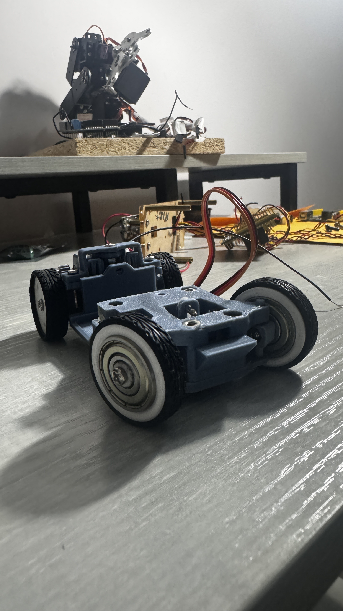
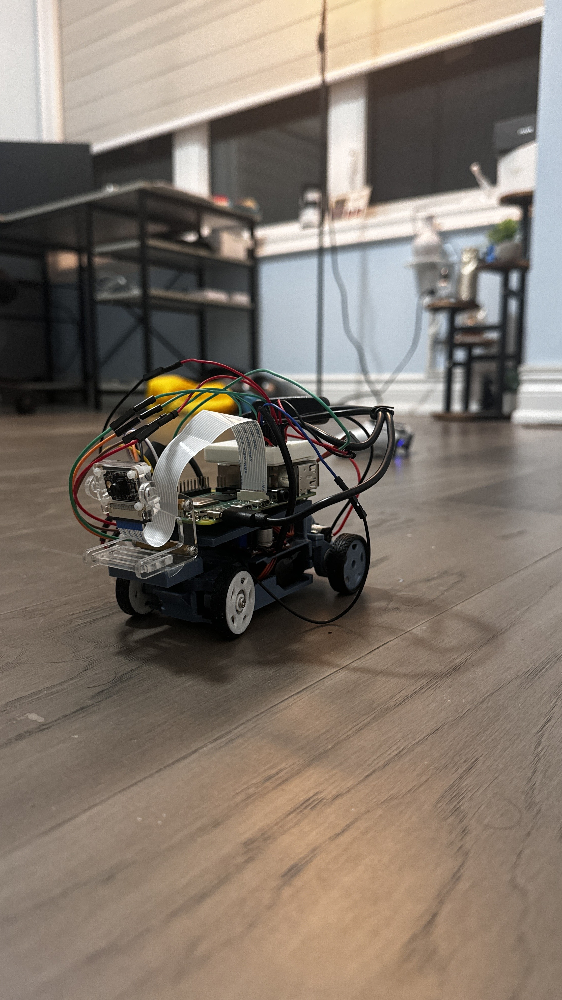

# Autonomous Object-Tracking Robotic Car 🚙

## ⚙️ **Summary**  

A dual-mode robotic car built on an **Raspberry Pi 4** that can autonomously track objects or be manually driven via a **PS4 controller**. Implemented in **C++** using **OpenCV** for computer vision, **pigpio** for low-level PWM motor/servo control, and the **Linux joystick API** for input. Optimized for low-latency control (<50 ms) and reliable tracking accuracy (±3 px).  

**Tech Stack:** C++ · OpenCV · pigpio · GStreamer · Linux Joystick API · Raspberry Pi 4 · TB6612FNG Motor Driver · Servo + DC Motors  

**Key Features:** Autonomous HSV-based object tracking · manual override via PS4 controller · low-latency camera + control loop · custom mechanical design  

---

<p align="center">
  
  &nbsp;&nbsp;&nbsp;
  
</p>

---

## 📈 **Key Results**  
- Reduced control latency from ~120 ms → <50 ms  
- Reliable HSV-based object tracking with ±3 px accuracy  
- Seamless mode switching between autonomous and manual  
- Designed + built custom mechanical mounts for motor driver and servo  
- Demonstrated low-cost embedded CV + control integration on Raspberry Pi  

---

## 🔍 **Explore** 

📄 Project Overview (coming soon)         
🎥 [Educational Demo Video](https://youtu.be/008SZhVjsog)         
🎥 [Fun Demo Video](https://youtube.com/shorts/qCwE8ejM1Z4?feature=share)         
🚙 [Car Chassis](car_chassis.jpg)        
🚙 [Final Car](final_car.jpg)         

---

## 💡 **Background**  

I’ve always been fascinated by cars and robotics, so I built this project to bring the two together. It gave me a hands-on way to explore how embedded systems and computer vision combine to create real autonomous vehicle behaviors — all at a low cost.

---

## 🧠 **A Quick Breakdown**  

**Dual-Mode Operation**  
- *Manual Mode*: PS4 controller input read via `/dev/input/js0` (Linux Joystick API).  
- *Autonomous Mode*: OpenCV processes live camera frames, identifies object position, and adjusts steering/throttle automatically.  

**Computer Vision**  
- Implemented an **HSV-based detection pipeline** (color masking, filtering, contour analysis, circle fitting).  
- Achieved **±3 px accuracy** in varied lighting conditions.  

**Low-Level Motor Control**  
- Used **pigpio** for PWM signals to servo and DC motors.  
- Integrated **TB6612FNG motor driver** for efficient dual-motor actuation.  
- Applied **dynamic PWM scaling + optimized driver logic** for smooth and consistent control.  

**Performance Optimization**  
- Reduced control latency from ~120 ms → <50 ms using:  
  - GStreamer pipeline with leaky-frame queues  
  - Asynchronous camera capture  
  - Non-blocking joystick reads  

---

## 🔧 **Tech Stack**  

- **Languages:** C++  
- **Libraries:** OpenCV 4 · pigpio  
- **Hardware:** Raspberry Pi 4 · TB6612FNG Motor Driver · Servo + DC Motors · PS4 Controller  
- **APIs:** Linux Joystick API (`/dev/input/js0`) · GStreamer video capture  

---

## ⚡ **Challenges & Solutions**  

- **Processing & Latency Issues**  
  - *Challenge:* Raspberry Pi Zero 2W’s limited CPU/GPU caused severe frame drops and input lag, and standard OpenCV capture added ~120 ms delay.
  - *Solution:* Upgraded to **Raspberry Pi 4** and implemented a GStreamer pipeline with leaky-frame queues, dropping old frames to process only the most recent, achieving stable, responsive performance.

- **Unstable Object Detection in Varying Light**  
  - *Challenge:* Bright sunlight or dim indoor lighting caused false positives in object detection.  
  - *Solution:* Designed an **HSV-based pipeline** with erosion/dilation filtering and contour analysis, improving detection robustness.  

- **Servo & Motor Jitter**  
  - *Challenge:* Direct PWM commands caused jitter and overcorrection in steering and throttle.  
  - *Solution:* Added **dynamic PWM scaling** and refined **TB6612FNG motor driver logic**, reducing unnecessary corrections and smoothing movement.  

- **Mechanical Design Issues**  
  - *Challenge:* Custom 3D-printed chassis and servo mounts introduced alignment problems, especially during sharp turns.  
  - *Solution:* Iterated on the mechanical design, reinforcing weak points and improving servo linkages, resulting in better stability and reliability.  

---
## 🚀 **Quickstart**  

```bash
# Clone repository
git clone https://github.com/yashp1932/autonomous-object-tracking-robotic-car.git
cd autonomous-object-tracking-robotic-car

# Build with CMake
mkdir build && cd build
cmake ..
make

# Run
sudo ./ball_auto_manual
```
---

## 🤝 Connect

Interested in embedded vision systems or robotics? Hit me up!

📧 Email: yash.panchal932@gmail.com       
🌐 GitHub: [yashp1932](https://github.com/yashp1932)      
💼 LinkedIn: www.linkedin.com/in/yashpchal      
